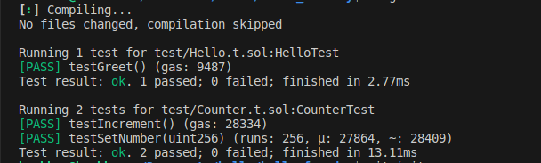
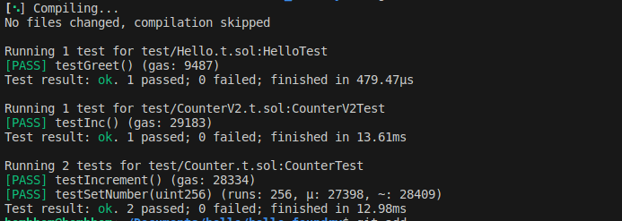
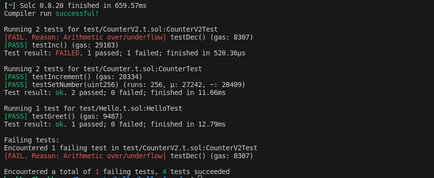
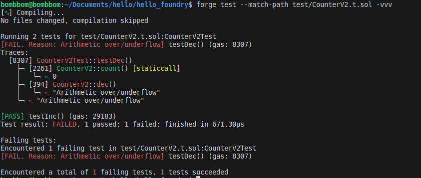
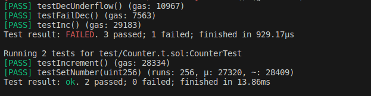
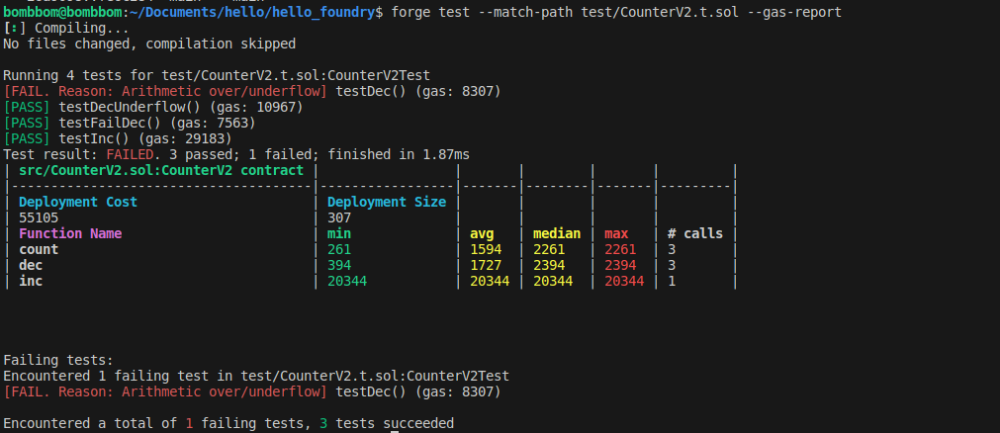

# 1. Foundry Zero to Master

- [1. Foundry Zero to Master](#1-foundry-zero-to-master)
  - [1.1. Hello foundry](#11-hello-foundry)
  - [1.2. Write basic tests](#12-write-basic-tests)
  - [1.3. Set version](#13-set-version)
  - [1.4. Remapping](#14-remapping)
  - [1.5. forge fmt](#15-forge-fmt)
  - [1.6. Console log](#16-console-log)
  - [1.7. Authentication](#17-authentication)
  - [1.8. Error](#18-error)
  - [1.9. Event](#19-event)
  - [1.10. Time](#110-time)
  - [1.11. Send ETH](#111-send-eth)
  - [1.12. Signature](#112-signature)
  - [1.13. Gas-Less Token Transfer](#113-gas-less-token-transfer)
  - [1.14. Fork](#114-fork)
  - [1.15. mint 1 million DAI on Mainnnet Fork](#115-mint-1-million-dai-on-mainnnet-fork)
  - [1.16. Fuzz](#116-fuzz)
  - [1.17. Invariant Testing](#117-invariant-testing)
  - [1.18. FFI](#118-ffi)
  - [1.19. Differential Test](#119-differential-test)
  - [1.20. Resource](#120-resource)


## 1.1. Hello foundry

- Install 
- forge init hello_foundry 
  - compile
  - test


## 1.2. Write basic tests 
- counterV2
  - test setup, ok, fail
  - match
  - verbose 
  - gas report

- Test function Inc:


- Test function Dec:


> count variable is uint 
> 
> call dec() when count=0 --> error





- show detail error

```
$ forge test --match-path test/CounterV2.t.sol -vvvvv
[⠢] Compiling...
No files changed, compilation skipped

Running 4 tests for test/CounterV2.t.sol:CounterV2Test
[FAIL. Reason: Arithmetic over/underflow] testDec() (gas: 8307)
Traces:
  [109608] CounterV2Test::setUp() 
    ├─ [55105] → new CounterV2@0x5615dEB798BB3E4dFa0139dFa1b3D433Cc23b72f
    │   └─ ← 275 bytes of code
    └─ ← ()

  [8307] CounterV2Test::testDec() 
    ├─ [2261] CounterV2::count() [staticcall]
    │   └─ ← 0
    ├─ [394] CounterV2::dec() 
    │   └─ ← "Arithmetic over/underflow"
    └─ ← "Arithmetic over/underflow"

[PASS] testDecUnderflow() (gas: 10967)
Traces:
  [109608] CounterV2Test::setUp() 
    ├─ [55105] → new CounterV2@0x5615dEB798BB3E4dFa0139dFa1b3D433Cc23b72f
    │   └─ ← 275 bytes of code
    └─ ← ()

  [10967] CounterV2Test::testDecUnderflow() 
    ├─ [0] VM::expectRevert(Arithmetic over/underflow) 
    │   └─ ← ()
    ├─ [2394] CounterV2::dec() 
    │   └─ ← "Arithmetic over/underflow"
    └─ ← ()

[PASS] testFailDec() (gas: 7563)
Traces:
  [109608] CounterV2Test::setUp() 
    ├─ [55105] → new CounterV2@0x5615dEB798BB3E4dFa0139dFa1b3D433Cc23b72f
    │   └─ ← 275 bytes of code
    └─ ← ()

  [7563] CounterV2Test::testFailDec() 
    ├─ [2394] CounterV2::dec() 
    │   └─ ← "Arithmetic over/underflow"
    └─ ← "Arithmetic over/underflow"

[PASS] testInc() (gas: 29183)
Traces:
  [109608] CounterV2Test::setUp() 
    ├─ [55105] → new CounterV2@0x5615dEB798BB3E4dFa0139dFa1b3D433Cc23b72f
    │   └─ ← 275 bytes of code
    └─ ← ()

  [29183] CounterV2Test::testInc() 
    ├─ [2261] CounterV2::count() [staticcall]
    │   └─ ← 0
    ├─ [20344] CounterV2::inc() 
    │   └─ ← ()
    ├─ [261] CounterV2::count() [staticcall]
    │   └─ ← 1
    └─ ← ()

Test result: FAILED. 3 passed; 1 failed; finished in 1.04ms

Failing tests:
Encountered 1 failing test in test/CounterV2.t.sol:CounterV2Test
[FAIL. Reason: Arithmetic over/underflow] testDec() (gas: 8307)

Encountered a total of 1 failing tests, 3 tests succeeded
```

- gas report 



## 1.3. Set version 

- foundry.toml 

```
[profile.default]
src = "src"
out = "out"
libs = ["lib"]
solc_version = "0.8.17"
optimizer = true 
optimizer_runs = 200
# See more config options https://github.com/foundry-rs/foundry/tree/master/config
```

## 1.4. Remapping
- forge install
- forge remappings
- forge update
- forge remove
- npm install Openzeppelin
- remappings.txt


- install solmate:

Install a dependency:


`forge install transmissions11/solmate`

Install a specific version of a dependency:


`forge install transmissions11/solmate@v7`

Install multiple dependencies:


`forge install transmissions11/solmate@v7 OpenZeppelin/openzeppelin-contracts`

Install a dependency without creating a submodule:


`forge install --no-git transmissions11/solmate`

Install a dependency in a specific folder:


`forge install soulmate=transmissions11/solmate`

- forge remappings

```
$forge remappings 
ds-test/=lib/forge-std/lib/ds-test/src/
forge-std/=lib/forge-std/src/
soulmate/=lib/soulmate/src/
```

- npm i @openzeppelin/contracts

- remappings.txt

## 1.5. forge fmt 

> Auto format code
> 

## 1.6. Console log

## 1.7. Authentication 

## 1.8. Error

## 1.9. Event 

## 1.10. Time

## 1.11. Send ETH 

## 1.12. Signature 

## 1.13. Gas-Less Token Transfer 

## 1.14. Fork 

## 1.15. mint 1 million DAI on Mainnnet Fork 

## 1.16. Fuzz

## 1.17. Invariant Testing


## 1.18. FFI

## 1.19. Differential Test 

## 1.20. Resource 

- [Foundry book](https://book.getfoundry.sh/)
- [Smart Contract Programmer](https://www.youtube.com/playlist?list=PLO5VPQH6OWdUrKEWPF07CSuVm3T99DQki)
